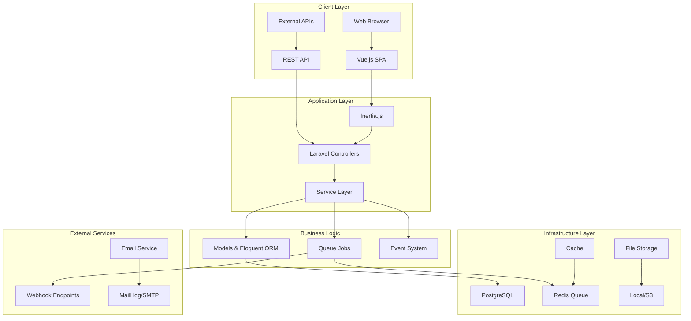
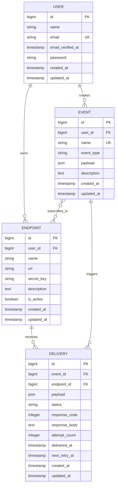
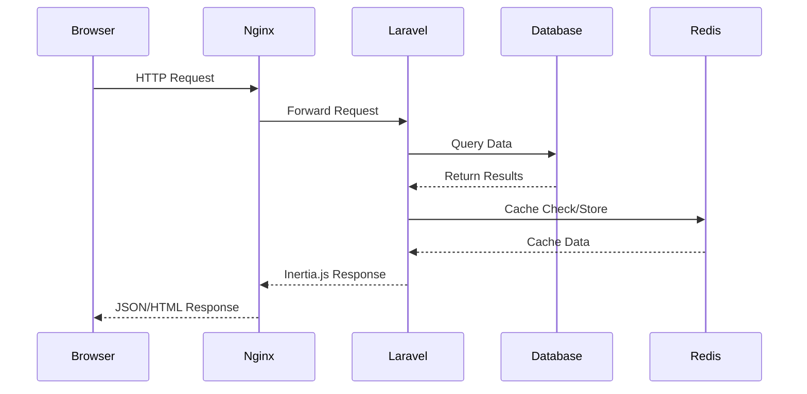
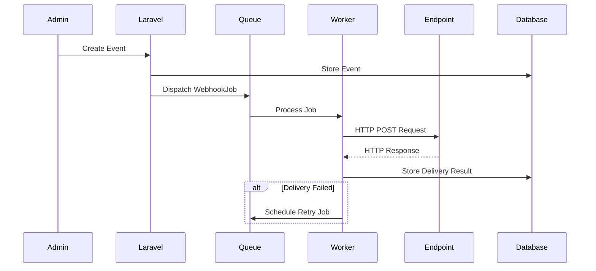
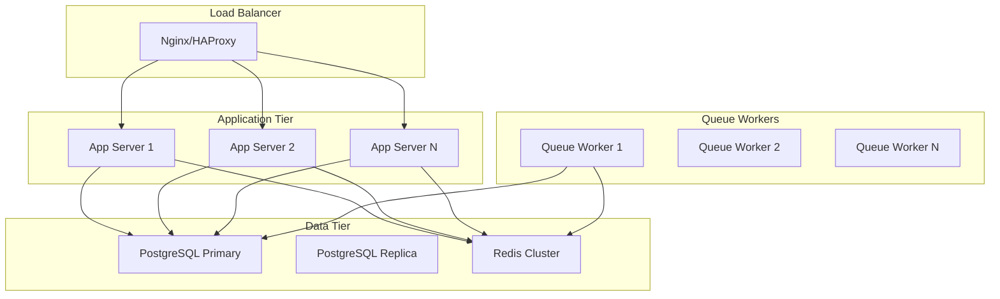

# 🏗️ Architecture Overview

This document provides a comprehensive overview of the Webhook Management Platform's architecture, design decisions, and system components.

## 🎯 System Overview

The Webhook Management Platform is designed as a scalable, enterprise-grade solution for managing webhook endpoints, processing events, and ensuring reliable delivery with comprehensive monitoring and analytics.

## 🏛️ High-Level Architecture



## 🔧 Core Components

### 1. Web Application Layer

#### Frontend (Vue.js + Inertia.js)
- **Vue.js 3**: Modern reactive framework with Composition API
- **Inertia.js**: SPA experience without API complexity
- **Tailwind CSS**: Utility-first CSS framework
- **Vite**: Fast build tool with hot module replacement

#### Backend (Laravel)
- **Laravel 11**: PHP framework with robust ecosystem
- **PHP 8.2+**: Modern PHP with enhanced performance
- **MVC Architecture**: Clear separation of concerns
- **Middleware**: Request filtering and authentication

### 2. Data Layer

#### Primary Database (PostgreSQL)
```sql
-- Core Tables
- users (user accounts and authentication)
- endpoints (webhook endpoint configurations)
- events (webhook events and payloads)
- event_endpoint (many-to-many relationship)
- deliveries (delivery attempts and responses)
- jobs (queue job management)
```

#### Cache & Session Store (Redis)
- **Session Management**: User session data
- **Cache Layer**: Application-level caching
- **Queue Backend**: Background job processing

### 3. Background Processing

#### Queue System
```php
// Job Types
- WebhookDeliveryJob: Handle webhook HTTP requests
- RetryFailedWebhooksJob: Process retry attempts
- CleanupOldDeliveriesJob: Database maintenance
- SendNotificationJob: Email notifications
```

#### Scheduler
- **Laravel Scheduler**: Cron-like job scheduling
- **Retry Logic**: Exponential backoff for failed deliveries
- **Cleanup Tasks**: Automatic data retention management

## 📊 Data Models & Relationships

### Entity Relationship Diagram



### Key Relationships

1. **User → Endpoints**: One-to-Many (User owns multiple endpoints)
2. **User → Events**: One-to-Many (User creates multiple events)
3. **Event → Endpoints**: Many-to-Many (Events can be delivered to multiple endpoints)
4. **Event → Deliveries**: One-to-Many (Each event can have multiple delivery attempts)
5. **Endpoint → Deliveries**: One-to-Many (Each endpoint receives multiple deliveries)

## 🔄 Request Flow

### 1. Web Request Flow


### 2. Webhook Delivery Flow


## 🔐 Security Architecture

### Authentication & Authorization
- **Laravel Sanctum**: API token authentication
- **Laravel Jetstream**: User authentication scaffolding
- **Team-based Access**: Multi-tenant architecture support
- **CSRF Protection**: Cross-site request forgery prevention

### Webhook Security
```php
// HMAC Signature Verification
$signature = hash_hmac('sha256', $payload, $endpoint->secret_key);
$expectedSignature = 'sha256=' . $signature;

if (!hash_equals($expectedSignature, $receivedSignature)) {
    throw new SecurityException('Invalid signature');
}
```

### Data Protection
- **Encrypted Environment**: Sensitive configuration encrypted
- **Database Encryption**: Sensitive fields encrypted at rest
- **HTTPS Enforcement**: All communications encrypted in transit
- **Input Validation**: Comprehensive request validation

## ⚡ Performance & Scalability

### Performance Optimizations

1. **Database Optimization**
   - Proper indexing on frequently queried columns
   - Query optimization with Eloquent relationships
   - Connection pooling and read replicas

2. **Caching Strategy**
   - Redis-based application caching
   - Query result caching
   - Session storage in Redis

3. **Queue Processing**
   - Background job processing
   - Queue workers for high-throughput processing
   - Job batching for bulk operations

### Scalability Considerations

1. **Horizontal Scaling**
   - Stateless application design
   - Load balancer ready
   - Container orchestration support (Docker)

2. **Database Scaling**
   - Read replica support
   - Connection pooling
   - Query optimization

3. **Queue Scaling**
   - Multiple queue workers
   - Queue prioritization
   - Failed job handling

## 🐳 Docker Architecture

### Container Strategy
```yaml
# Multi-service architecture
services:
  app:           # Laravel application (PHP-FPM)
  nginx:         # Web server and reverse proxy
  db:            # PostgreSQL database
  redis:         # Cache and queue backend
  queue:         # Background queue worker
  scheduler:     # Laravel task scheduler
  mailhog:       # Development email testing
```

### Development vs Production
- **Development**: Debug mode, file watching, verbose logging
- **Production**: Optimized builds, minimal logging, security hardening

## 📈 Monitoring & Observability

### Application Monitoring
- **Laravel Telescope**: Development debugging and profiling
- **Log Aggregation**: Structured logging with context
- **Performance Metrics**: Response times and throughput tracking

### Health Checks
```php
// Health check endpoints
GET /health              // Basic application health
GET /health/database     // Database connectivity
GET /health/redis        // Redis connectivity
GET /health/queue        // Queue worker status
```

### Error Handling
- **Graceful Degradation**: Fallback mechanisms for service failures
- **Circuit Breaker**: Prevent cascading failures
- **Retry Logic**: Intelligent retry strategies with backoff

## 🔧 Configuration Management

### Environment-based Configuration
```env
# Application
APP_ENV=production
APP_DEBUG=false
APP_URL=https://webhook-platform.com

# Database
DB_CONNECTION=pgsql
DB_HOST=db
DB_DATABASE=webhook_management

# Queue & Cache
QUEUE_CONNECTION=redis
CACHE_DRIVER=redis
REDIS_HOST=redis

# Webhook Settings
WEBHOOK_TIMEOUT=30
WEBHOOK_MAX_RETRIES=5
WEBHOOK_RETRY_DELAY=300
```

### Feature Flags
- **Environment-based**: Different features per environment
- **Database-driven**: Runtime feature toggling capability
- **User-based**: Per-user or per-team feature access

## 🚀 Deployment Architecture

### Production Deployment


### CI/CD Pipeline
1. **Code Commit**: Developer pushes changes
2. **Automated Testing**: Unit and feature tests
3. **Build Process**: Docker image creation
4. **Security Scanning**: Vulnerability assessment
5. **Deployment**: Blue-green deployment strategy
6. **Health Checks**: Post-deployment verification

## 📋 Design Patterns

### Backend Patterns
- **Repository Pattern**: Data access abstraction
- **Service Layer Pattern**: Business logic encapsulation
- **Observer Pattern**: Event-driven architecture
- **Queue Pattern**: Asynchronous processing
- **Factory Pattern**: Object creation abstraction

### Frontend Patterns
- **Component-based Architecture**: Reusable Vue components
- **Composition API**: Logic composition and reuse
- **Single Responsibility**: Components with focused purposes
- **Props Down, Events Up**: Data flow pattern

---

## 🎯 Future Architecture Considerations

### Microservices Migration
- **API Gateway**: Central routing and authentication
- **Service Decomposition**: Separate webhook processing service
- **Event Sourcing**: Complete audit trail of system events
- **CQRS**: Command Query Responsibility Segregation

### Advanced Features
- **Webhook Transformations**: Payload transformation pipeline
- **Rate Limiting**: Per-endpoint rate limiting
- **Analytics Engine**: Advanced webhook analytics and insights
- **Multi-region Deployment**: Global webhook delivery optimization

This architecture provides a solid foundation for a scalable, maintainable webhook management platform while allowing for future enhancements and optimizations.
